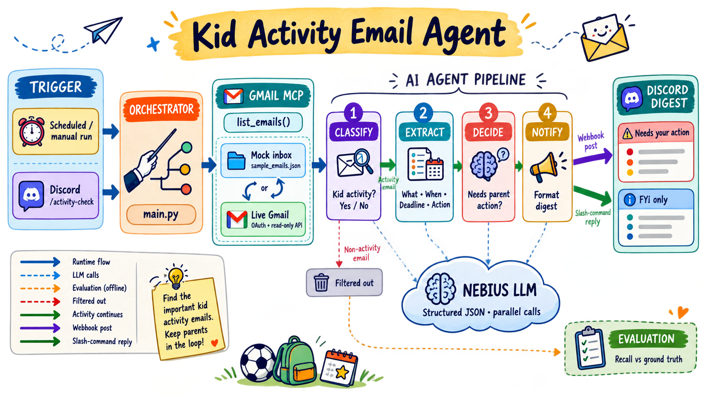
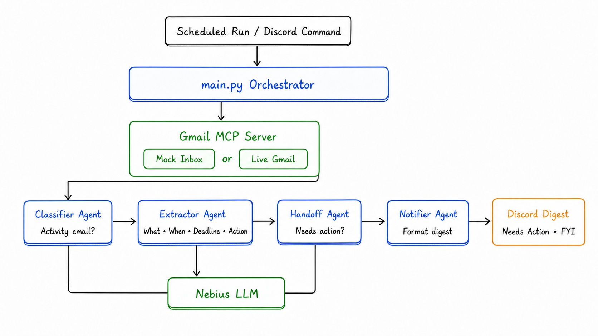

# Kid Activity Email Triage — Multi-Agent Pipeline



I can't check email daily, so I miss permission slips, schedule changes, and
payment deadlines for my kids' activities. This is a small multi-agent
pipeline that fetches emails, triages them, and delivers a digest to
Discord (which I do check daily) — either on a schedule/on demand via a
one-shot script, or interactively via a Discord slash command.

## Architecture



```
mcp_server/gmail_mock.py  or  mcp_server/gmail_real.py   (picked via GMAIL_SOURCE)
             tool: list_emails(query)
                      |
         MCP client (main.py / bot.py)
                      |
                      v
      classifier_agent  -> is_activity: Y/N            (parallel across emails)
                      |
           (activity emails only)
                      v
      extractor_agent   -> what / when / deadline / action_needed   (parallel)
                      |
                      v
      handoff_agent     -> needs_action: Y/N (RSVP, payment, signature, reply)   (parallel)
                      |
                      v
      notifier_agent    -> formats the digest
                      |
        +-------------+--------------+
        |                            |
   main.py: POST to a          bot.py: reply to /activity-check
   Discord webhook             (on-demand, with days/since/until/
   (one-shot / scheduled)       sender/keyword filter options)
```

Each agent is one function/module under `agents/`, with a single clear
responsibility, so they can be read, tested, and explained independently.
The mock and real Gmail MCP servers expose the identical `list_emails(query)`
tool shape, so every agent and both entry points (`main.py`, `bot.py`) work
unmodified against either one.

## Components

- `data/sample_emails.json`, `data/ground_truth.json` — sample inbox and
  hand-labeled truth set (`is_activity`, `needs_action` per email) used by
  `eval.py` and by `GMAIL_SOURCE=mock`.
- `mcp_server/gmail_mock.py` — MCP server that serves the sample dataset.
- `mcp_server/gmail_real.py` + `mcp_server/gmail_auth_setup.py` — MCP server
  backed by the live Gmail API (OAuth2, `gmail.readonly` scope).
- `agents/classifier_agent.py`, `extractor_agent.py`, `handoff_agent.py`,
  `notifier_agent.py` — the four pipeline stages.
- `agents/llm_client.py` — shared Nebius (OpenAI-compatible) chat client,
  plus a thread-pool helper that runs each stage's per-email LLM calls
  concurrently.
- `main.py` — one-shot pipeline run: fetch → classify → extract → handoff →
  post digest to a Discord webhook. Meant to be triggered by an external
  scheduler (e.g. Windows Task Scheduler) for a recurring digest.
- `bot.py` — Discord bot exposing `/activity-check`, for running the
  pipeline on demand from Discord itself, with optional filter options.
- `eval.py` — prints classifier recall against `data/ground_truth.json`.

## Setup

```
pip install -r requirements.txt
cp .env.example .env
```

Fill in `.env`:

| Variable | Used by | Notes |
|---|---|---|
| `NEBIUS_API_KEY`, `NEBIUS_BASE_URL`, `NEBIUS_MODEL` | classifier/extractor/handoff agents | [Nebius AI Studio](https://studio.nebius.ai/), OpenAI-compatible API |
| `DISCORD_WEBHOOK_URL` | `main.py` | channel webhook for the scheduled/manual digest post |
| `GMAIL_SOURCE` | `main.py`, `bot.py` | `mock` (default, sample data) or `real` (live Gmail) |
| `GMAIL_QUERY` | `gmail_real.py` | default Gmail search query, e.g. `newer_than:1d` |
| `DISCORD_BOT_TOKEN`, `DISCORD_GUILD_ID` | `bot.py` | bot token; guild ID makes the slash command sync instantly instead of waiting up to an hour for global sync |

### Real Gmail OAuth (only needed for `GMAIL_SOURCE=real`)

1. In [Google Cloud Console](https://console.cloud.google.com): create a
   project, enable the **Gmail API**, and configure the OAuth consent
   screen (External; add yourself as a test user; under **Data access**
   add the `.../auth/gmail.readonly` scope).
2. **Credentials → Create Credentials → OAuth client ID**, application type
   **Desktop app**. Download the JSON and save it as
   `mcp_server/credentials.json` (gitignored — never commit it).
3. Run the one-time consent flow:
   ```
   python mcp_server/gmail_auth_setup.py
   ```
   This opens a browser for Google's consent screen and saves
   `mcp_server/token.json` (also gitignored), which is refreshed
   automatically afterward.

### Discord webhook (for `main.py`)

Channel → Edit Channel → Integrations → Webhooks → New Webhook → copy the
URL into `DISCORD_WEBHOOK_URL`.

### Discord bot (for `bot.py`)

1. [Discord Developer Portal](https://discord.com/developers/applications)
   → New Application → **Bot** → copy the token into `DISCORD_BOT_TOKEN`.
2. **OAuth2 → URL Generator** → scopes `bot` + `applications.commands` →
   permissions `Send Messages` + `Use Slash Commands` → open the generated
   URL and invite the bot to your server.
3. (Optional) enable Developer Mode in Discord (User Settings → search
   "developer mode"), then right-click your server icon → **Copy Server
   ID** → `DISCORD_GUILD_ID`.

## Running it

```
python eval.py     # prints classifier recall against ground truth
python main.py      # one-shot: fetch, run the pipeline, post to the webhook
python bot.py        # starts the bot; then in Discord: /activity-check
```

`/activity-check` takes optional filter options that map directly to Gmail
search operators (no extra LLM call, so they don't add latency):
`days` (look back N days), `since` / `until` (YYYY-MM-DD), `sender`,
`keyword`.

## Design notes

- **MCP tool boundary stays fixed across mock and real.** `list_emails`
  has the identical signature and return shape in both servers; swapping
  `GMAIL_SOURCE` is the only change needed anywhere downstream.
- **Parallel LLM calls.** Classifying/extracting/deciding on N emails
  means N independent LLM calls per stage; `agents/llm_client.run_concurrently`
  runs them through a thread pool (I/O-bound network calls, so threads
  help despite the GIL) instead of one at a time.
- **Structured filters, not a free-text parsing agent.** `bot.py`'s slash
  command options map straight onto Gmail's own query syntax
  (`newer_than:`, `after:`, `before:`, `from:`, keywords) rather than
  routing a natural-language filter through another LLM call — precise
  and adds no round-trip latency.
- **Body truncation.** A real inbox includes marketing/HTML-only emails
  whose body can run past 100K characters (no `text/plain` part).
  `gmail_real.py` caps each body at `MAX_BODY_CHARS` so LLM calls stay
  fast and cheap.
- **Paginated fetch, not a single page.** A bounded query like
  `newer_than:2d` can match more than one Gmail list page in a noisy
  inbox, and a relevant email can sort behind a burst of newsletters —
  stopping at the first page can silently drop it before the classifier
  ever sees it. `gmail_real.py` pages via `nextPageToken` up to
  `MAX_TOTAL_RESULTS` (a safety cap, not unlimited), fetching messages
  concurrently to keep it fast.

## Metric: recall

`eval.py` measures **recall** — of the emails hand-labeled `is_activity:
true` in `data/ground_truth.json`, what fraction did `classifier_agent`
correctly flag? Precision, latency, and handoff-accuracy aren't tracked
here.

## Known limitations / possible next steps

- Real Gmail fetch is still capped at `MAX_TOTAL_RESULTS` matching
  messages (a safety limit across all pages), not truly unlimited — a
  wider query than that cap covers would need raising the constant or
  looping runs.
- No rate-limit/backoff handling beyond what the Gmail and OpenAI/Nebius
  SDKs do by default.
- No persistence layer — every run is stateless (reprocesses whatever
  matches the current query; there's no "already seen" tracking, so
  overlapping windows can produce duplicate digest entries across runs).
- `main.py` has no built-in scheduler; pair it with an external one (cron,
  Windows Task Scheduler) for a recurring digest.
